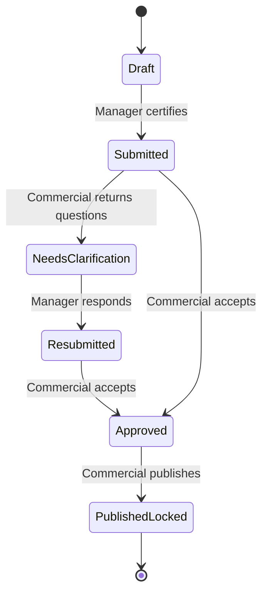

# Atlas User Flows

**Version:** 1.0  
**Status:** Build-ready workflow specification  
**Last updated:** 1 August 2026

## 1. Roles

| Role | Goal |
|---|---|
| Department Manager | Prepare, verify and certify the department’s weekly position |
| Commercial Manager | Validate departmental evidence, consolidate performance and publish a decision-ready update |
| CEO / Executive | Understand outcomes and record where intervention is required |
| Prototype Admin | Switch personas and reset deterministic demo scenarios |

## 2. Core reporting lifecycle

Published cycles are immutable. Corrections after publication create a new revision with an audit record.

## 3. Flow A — Reporting cycle opens

**Actor:** System simulation / Prototype Admin  
**Precondition:** A reporting-cycle fixture exists.

1. Atlas activates the weekly reporting period.
2. Locked baselines, required departments and due date are applied.
3. Each Department Manager sees a Submissions Due card and the required report in history.
4. Commercial Manager sees readiness calculated from required departmental reports.
5. CEO continues to see the latest published cycle, not the open unpublished cycle.

**Outcome:** The cycle is open and ready for departmental input.

## 4. Flow B — Create a departmental report

**Actor:** Department Manager  
**Entry:** Department Dashboard → New Report.

### 4.1 Details & Method

1. Select Project/Asset.
2. Confirm the automatically populated, locked Department.
3. Select Reporting Period.
4. Review or edit the generated Submission Title.
5. Review the locked baseline information.
6. Select one or more of the four top-level methods:
   - Atlas Structured Form
   - Document Upload
   - XLSX Upload
   - Paste Email or Call Transcript
7. Continue becomes enabled only after required details and at least one method are complete.
8. Select Continue.

**Validation:** A manager cannot create a second independent certified report for the same department and cycle; Atlas opens the existing draft/revision instead.

### 4.2 Content

1. Atlas renders each selected method input.
2. The manager completes or attaches the selected sources.
3. Each source receives a visible processing state.
4. The manager may choose Add Another Source and add any supported type, including another source of the same type.
5. Atlas produces a deterministic standardised draft.
6. The manager enters extraction review.

## 5. Flow C — Structured Form

1. Open the department-specific guided form.
2. Complete required metrics, narrative, risks, actions and forecast fields.
3. Atlas validates unit, data type, range and required explanation rules.
4. A material variance requires an explanation.
5. The manager may attach supporting evidence.
6. Save Source adds the form to the report source list.

**Error states:** missing required value, invalid unit, out-of-range value, missing variance explanation and save failure.

## 6. Flow D — Document Upload

**Accepted prototype types:** PDF and DOCX.

1. Select or drop a document.
2. Atlas validates file type and configured size limit.
3. Upload state changes from Uploading → Processing → Extracted.
4. The deterministic fixture maps content into standard fields.
5. Extracted values retain file, page and section references.
6. Unsupported or fixture-unknown content uses a Failed Extraction state with retry/replace/manual-review options.
7. The original document remains accessible from the source list.

## 7. Flow E — XLSX Upload

1. Select an XLSX workbook.
2. Atlas validates the file and lists available worksheets.
3. The manager chooses the relevant sheet(s).
4. For an Atlas template, predefined mapping is applied.
5. For an existing workbook, the manager reviews a simulated column mapping.
6. Atlas validates dates, numeric values, units and required columns.
7. The preview identifies invalid or unmapped rows without discarding valid data.
8. Extracted values retain workbook, worksheet and cell/range references.
9. Save Mapping completes the source.

## 8. Flow F — Paste Email or Call Transcript

This is one top-level method.

1. Open Paste Email or Call Transcript.
2. Select Source Type: Email or Call Transcript.
3. If Email, enter/paste:
   - Subject
   - Sender
   - Received date
   - Related asset/project
   - Message body
4. If Call Transcript, enter/paste:
   - Call title
   - Call date
   - Participants, if known
   - Transcript
5. Select Process Content.
6. Atlas deterministically identifies metrics, explanations, risks, decisions, commitments, owners and due dates supported by the demo fixture.
7. Extracted values retain exact text excerpts and source metadata.
8. The manager reviews speaker/sender attribution and corrects it where needed.

**Blocking validation:** Source Type and content are required.

## 9. Flow G — Add, replace or remove sources

### Add

1. Select Add Another Source.
2. Choose one of the four methods.
3. Complete the source flow.
4. Atlas re-runs standardisation and flags new conflicts.

### Replace

1. Select Replace on a source.
2. Confirm that current extraction references will be superseded.
3. Add the replacement.
4. Atlas retains the prior source event in audit history and reprocesses the draft.

### Remove

1. Select Remove.
2. If no standardised values depend on the source, confirm removal.
3. If values depend on it, Atlas lists the affected fields and warns that they may become missing or change.
4. Confirm removal; Atlas revalidates the report.

## 10. Flow H — Standardisation, conflict resolution and correction

**Layout:** Original source left; standardised report right.

1. Atlas displays mapped departmental sections.
2. Every extracted value shows a source reference and confidence label where applicable.
3. Missing required fields appear in a blocking list.
4. Low-confidence items require explicit confirmation or correction.
5. Contradictory values display side by side with source, reporting date and owner.
6. The manager resolves each conflict by:
   - Selecting an authoritative value; or
   - Entering a corrected value and explanation.
7. Atlas retains original extracted values.
8. Each correction creates an audit event.
9. Atlas recalculates variance and readiness.

**Rule:** Atlas never silently selects between contradictory values.

## 11. Flow I — Certify and submit

1. Atlas checks required fields, conflicts, required variance explanations and source validity.
2. The manager reviews the certification statement.
3. The manager checks certification.
4. Submit Report becomes enabled.
5. On submit, Atlas records manager, timestamp and report revision.
6. Status becomes Submitted or Resubmitted.
7. The report becomes read-only for the manager until returned.
8. Commercial readiness and review queues refresh.

**Blocked submission reasons:** missing field, unresolved conflict, invalid value, missing explanation, incomplete source processing or unchecked certification.

## 12. Flow J — Commercial dashboard triage

1. Commercial Manager selects the reporting period.
2. Reporting Readiness recalculates.
3. The manager scans project, production, finance, legal and HSE summaries.
4. Attention Required ranks report and issue exceptions.
5. Today’s Priorities lists required review/publish actions.
6. Selecting an item opens the relevant review drawer or full review page.

**Outcome:** The Commercial Manager chooses the highest-value exception without leaving the dashboard context unnecessarily.

## 13. Flow K — Commercial review and approval

1. Open a Submitted or Resubmitted report.
2. Review standardised values, narrative and variance flags.
3. Open source references and original evidence.
4. Review conflicts, corrections and audit events.
5. Choose one outcome:
   - Approve
   - Request Clarification
   - Apply Controlled Override, then continue review
6. On approval, status becomes Approved and readiness recalculates.

### Request Clarification

1. Select a field or section.
2. Enter a specific question.
3. Set response due date if needed.
4. Submit request.
5. Status becomes Needs Clarification.
6. Department Manager sees a Returned Submission and notification.

### Controlled Override

1. Select an overridable field.
2. Review the department-approved value and evidence.
3. Enter revised value.
4. Enter mandatory reason.
5. Confirm.
6. Atlas preserves both values and records reviewer and timestamp.

## 14. Flow L — Respond and resubmit

1. Department Manager opens Returned Submissions.
2. Atlas highlights every question in context.
3. The manager adds a response, correction or new source.
4. All questions require a response or explicit resolution.
5. The manager re-certifies.
6. Status becomes Resubmitted.
7. Commercial Manager sees the report return to the review queue with changes highlighted.

## 15. Flow M — Consolidate and publish executive update

1. Commercial Manager reviews the consolidated metric set.
2. Atlas shows reporting completeness, outstanding exceptions and controlled overrides.
3. The manager edits the executive narrative and recommendations.
4. Publish remains disabled until all mandatory reports are Approved or an auditable controlled exception is recorded.
5. The manager previews the executive update.
6. Select Publish.
7. Confirm synthetic prototype publication.
8. Atlas records the publication event and locks the cycle.
9. The CEO workspace switches to the newly published cycle.

## 16. Flow N — CEO review and decision

1. CEO opens the latest published Executive Overview.
2. Scan Overall Project Status, HSE and Legal Exposure.
3. Inspect Production and Cashflow charts.
4. Select a recommendation or metric to view explanation and evidence.
5. Choose a decision action:
   - Approve
   - Defer
   - Request More Information
   - Assign an Action
   - Record a Decision
6. Add rationale where applicable.
7. Assignment additionally requires owner and due date.
8. Confirm decision.
9. Atlas records an audit event and updates recommendation status.
10. Commercial and responsible Department workspaces receive the resulting action.

## 17. Flow O — Closed-loop action management

1. Responsible manager sees the CEO-assigned action.
2. Open the action to view originating recommendation, decision, owner and due date.
3. Update status: Not Started, In Progress, Awaiting Verification or Completed.
4. Add evidence or progress note.
5. Commercial Manager verifies completion where required.
6. Audit history remains linked to the published cycle.

## 18. Flow P — Filters, drill-through and export

### Filters

1. Change reporting period or asset context.
2. Show a loading state without shifting the structural grid.
3. Refresh all related cards, charts and tables together.
4. If a selection has no data, show a contextual empty state.

### Metric drill-through

1. Select KPI, chart point or table record.
2. Open detail route or drawer specified by the page structure.
3. Show value, unit, period, plan/target, owner, review state, explanation and source references.

### Export

1. Select Export.
2. Choose the supported prototype format/view.
3. Atlas generates a mocked or print-ready export from the active filters.
4. Export includes generated timestamp, filter context and synthetic-data disclosure.

## 19. Persona and reset flow

**Prototype-only:**

1. Prototype Admin opens persona/scenario control.
2. Choose Department Manager, Commercial Manager or CEO.
3. Atlas applies route permissions and seeded state.
4. Reset Scenario restores the canonical mock dataset and clears local workflow changes after confirmation.

## 20. Audit event requirements

Create a visible audit event for:

- Source added, replaced or removed
- Extracted value corrected
- Conflict resolved
- Certification and submission
- Clarification requested and answered
- Controlled override
- Approval
- Executive narrative edit
- Publication/lock
- CEO decision or assignment
- Action status update or completion

Each event includes actor, role, action, entity, timestamp and relevant before/after values.

## 21. Critical end-to-end acceptance paths

### Happy path

Department report created → two sources added → extraction reviewed → certified → submitted → Commercial approves → update published → CEO assigns action → manager receives action.

### Conflict path

Document and XLSX disagree → both values displayed → manager selects authoritative value and explains → audit event created → submission succeeds.

### Return path

Commercial asks field-level question → report becomes Needs Clarification → manager adds evidence and response → re-certifies → Resubmitted → Commercial approves.

### Override path

Commercial changes a manager-approved value → reason required → original and revised values retained → executive view uses revised value → evidence remains traceable.

### Gate path

One mandatory report unapproved → Publish disabled → controlled exception recorded or report approved → Publish enabled.
